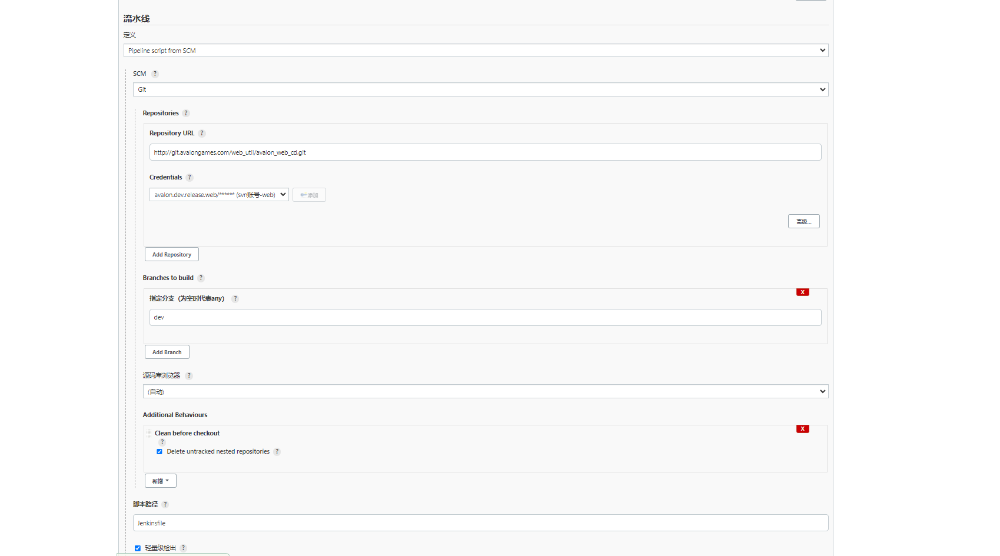
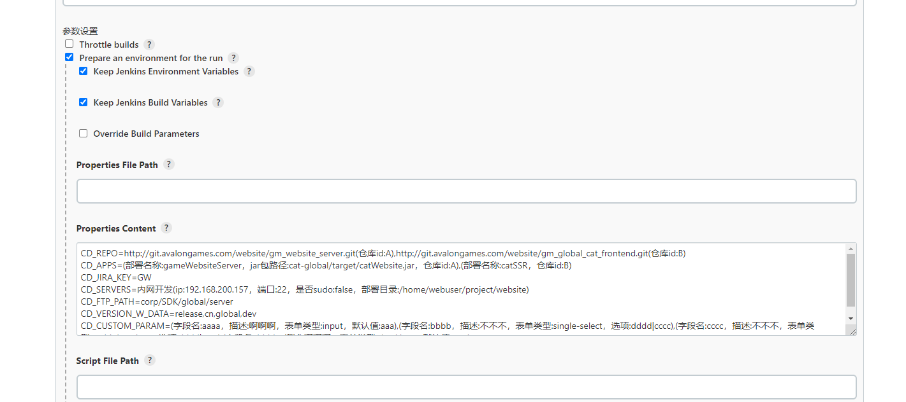

## 开发相关

### pipeline语法校验
+ 地址 https://newjenkins.avalongames.com/pipeline-model-converter/validate
+ 快捷键 shift + alt + v

## 开始使用

### 自定义格式说明
value(propId1:propValue1，propId2:propValue2)
上面的字符串表示，值为value，包含两个字段，字段名propId1对应的值为propValue1，字段名propId2对应的值为propValue2；如果是数组，以英文逗号分隔

### 使用条件
+ jenkins项目必须时pipeline类型的，配置从git拉取脚本
> 仓库地址 http://git.avalongames.com/web_util/avalon_web_cd.git
> 凭据选 web
> 分支选 main
+ 只适应于web平台内部项目，目前支持web前端，node后端应用，laravel应用，java应用，未识别的类型不做额外处理
+ 代码仓库只支持公司svn或公司git
+ 更新应用时，node应用需要在应用同级目录配置一个同名的pm2配置文件*.json作为启动/停止脚本，比如IAMManage和IAMManage.json
+ java应用需要在应用的根目录下配置一个同名的业务配置文件*.properties，比如SuperSDK/SuperSDK.jar和SuperSDK/SuperSDK.properties

### jenkins工程配置方法

#### 1.配置流水线脚本


+ 从SCM获取，类型=git
+ 仓库地址=http://git.avalongames.com/web_util/avalon_web_cd.git
+ 凭据=svn账号-web
+ 指定分支=main
+ 脚本路径=Jenkinsfile
+ 勾选轻量化检出
+ 增加额外行为，Clean before checkout，勾选Delete untracked nested 
repositories

#### 2.配置环境变量



+ 参数设置勾选Prepare an environment for the run
+ 在Properties Content内设置环境变量，格式参考下面的使用教程

### 使用教程
+ 每个应用支持自定义构建脚本，执行路径为应用根目录/custom-build/build.sh，在压缩成zip前执行
+ 每个应用支持自定义更新脚本，执行路径为应用根目录/custom-build/before-app-start.sh，在目标服务器应用启动前执行

#### 环境变量说明

+ CD_REPO
> 是否必填：是
> 含义：仓库地址，git仓库末尾需要包含.git
> 解析类型：数组，元素格式=自定义格式，说明如下
> 示例1：http://git.avalongames.com/website/gm_website_server.git
> 示例2：http://git.avalongames.com/website/gm_website_server.git(仓库id:A),http://git.avalongames.com/website/gm_global_cat_frontend.git(仓库id:B)
>
> | id | 是否必填 | 值 |
> | -- | -- | -- |
> | value | 是 | 仓库地址 |
> | 仓库id | 否 | 仓库id，配合应用列表使用，只有一个仓库时可以不标记，多个仓库必须标记 |

+ CD_APPS
> 是否必填：是
> 含义：应用列表，根目录为仓库
> 解析类型：数组，元素格式=自定义格式，说明如下
> 
> | id | 是否必填 | 值 |
> | -- | -- | -- |
> | value | 否 | 应用的相对目录，如果应用是根目录为空字符串 |
> | 部署名称 | 否 | 交付时应用的名字，默认使用相对目录的最后一段 |
> | jar包路径 | 否 | mvn生成的jar包路径，仅java应用时生效，并且必须 |
>
> 示例1：(部署名称:gameWebsiteServer，jar包路径:cat-global/target/catWebsite.jar)
> 示例2：FrontEnd,OaToolsManage

+ CD_ZIP_ROOT
> 是否必填：否
> 含义：zip包的根目录，默认空字符串
> 解析类型：string
> 示例：web

+ CD_ZIP_PREFIX
> 是否必填：否
> 含义：zip包的前缀，运维有强制要求，默认使用jenkins工程名
> 解析类型：string
> 示例：Web-ConstConfig

+ CD_JIRA_KEY
> 是否必填：是
> 含义：jira项目的key
> 解析类型：string
> 示例：GW

+ CD_SERVERS
> 是否必填：是
> 含义：服务器列表
> 解析类型：数组，元素格式=自定义格式，说明如下
> 
> | id | 是否必填 | 值 |
> | -- | -- | -- |
> | value | 是 | 显示名称 |
> | ip | 是 | ssh的ip |
> | 端口 | 是 | ssh的端口 |
> | user | 否 | 运行应用的linux用户,默认为webuser |
> | 是否sudo | 是 | 操作应用时是否sudo,true或false |
> | 部署目录 | 是 | 应用部署目录 |
>
> 示例：内网开发(ip:192.168.200.157，端口:22，是否sudo:false，部署目录:/home/webuser/project/website) 

+ CD_FTP_PATH
> 是否必填：是
> 含义：ftp上传地址
> 解析类型：string
> 示例：corp/SDK/global/server

+ CD_VERSION_W_DATA
> 是否必填：否
> 含义：版本号W位，影响包名，默认包名不追加该段格式
> 解析类型：数组，元素格式=string
> 示例：release,cn,global,dev

+ CD_WEB_MODE_DATA
> 是否必填：否
> 含义：web构建模式，影响前端工程的构建命令，如果存在执行npm run release:xxx，不存在执行npm run release,当为normal时，也执行npm run release
> 解析类型：数组，元素格式=string
> 示例：out,mac

+ CD_CUSTOM_PARAM
> 是否必填：否
> 含义：自定义参数，配合自定义构建脚本、自定义更新脚本使用
> 解析类型：数组，元素格式=自定义格式，说明如下
> 
> | id | 是否必填 | 值 |
> | -- | -- | -- |
> | 字段名 | 是 | 表单id |
> | 描述 | 是 | 表单描述 |
> | 表单类型 | 是 | 表单组件类型,支持input/single-select/multiple-select/checkbox |
> | 默认值 | 否 | 表单默认值,仅input、checkbox时生效 |
> | 选项 | 否 | 以英文竖线隔开,仅single-select/multiple-select时生效 |
>
> 示例：(字段名:aaaa，描述:啊啊啊，表单类型:input，默认值:aaa),(字段名:bbbb，描述:不不不，表单类型:single-select，选项:dddd\|cccc),(字段名:cccc，描述:不不不，表单类型:multiple-select，选项:dddd\|cccc),(字段名:dddd，描述:啊啊啊，表单类型:checkbox，默认值:true)

+ 示例1：OA工具的环境变量配置示例

```
CD_REPO=http://git.avalongames.com/oa_tools/oa_tools.git
CD_APPS=FrontEnd,OaToolsManage
CD_ZIP_ROOT=web
CD_JIRA_KEY=OA
CD_SERVERS=内网测试(user:webuser，ip:192.168.200.217，端口:22，是否sudo:false，部署目录:/online/web/oatools)
CD_FTP_PATH=corp/OaTools

```

+ 示例2：游戏官网后台管理服务器的环境变量配置示例

```

CD_REPO=http://git.avalongames.com/website/gm_website_server.git
CD_APPS=(部署名称:gameWebsiteServer，jar包路径:cat-global/target/catWebsite.jar)
CD_JIRA_KEY=GW
CD_SERVERS=内网开发(ip:192.168.200.157，端口:22，是否sudo:false，部署目录:/home/webuser/project/website)
CD_FTP_PATH=corp/SDK/global/server
CD_VERSION_W_DATA=release,cn,global,dev

```